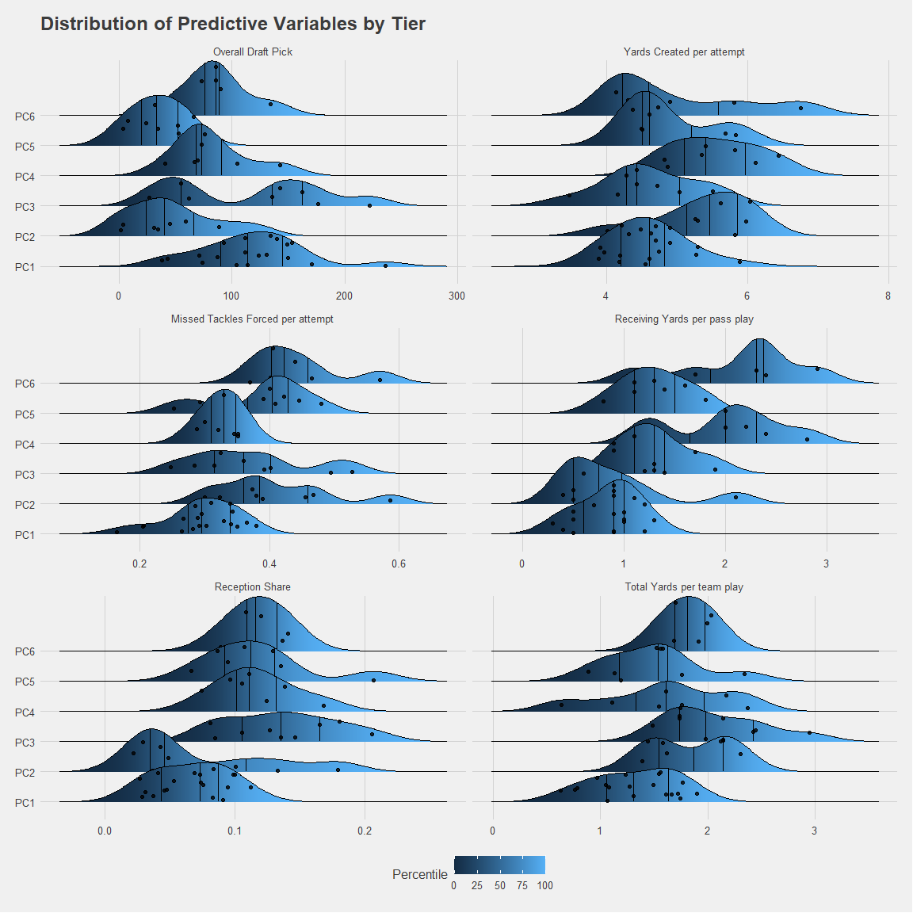
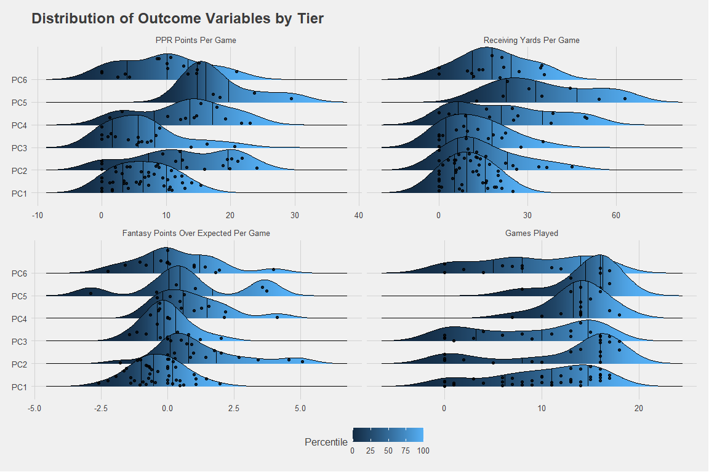

RB Clustering with Yards Created
================
Joe Sydlowski

  - [Introduction](#introduction)
  - [Why PCA?](#why-pca)
  - [Exploring the Data](#exploring-the-data)
  - [Principal Component Analysis](#principal-component-analysis)
  - [Results](#results)

## Introduction

Principal Component Analysis (PCA) is an unsupervised machine learning
technique used to group players into clusters with similar
characteristics while avoiding overfitting. I have combined this
technique with some notably predictive metrics such as Graham Barfield’s
*Yards Created* and JJ Zachariason’s *prospect model* to create
tier-groupings of rookie running backs.

## Why PCA?

An unsupervised machine learning model does not have an outcome
variable, which is especially useful in prospecting rookie RBs for two
reasons. Many outcome variables set arbitrary thresholds where a top 24
RB season is considered a success but an RB25 finish is then considered
a failure. By using an unsupervised model we can cluster similar RBs
into similar groups and later see how the clusters performed in a
variety of outcome variables. Secondly, using an unsupervised model
prevents us from over-fitting the model on an outcome variable in our
small sample sizes. For example, if you wanted to predict rushing yards
for rookie RBs using draft capital a supervised machine learning model
might look to undrafted free agent Phillip Lindsay’s 2018 rookie season
and underestimate the importance of being drafted. This over-fitting
could result in high predictions for future UDFA RBs as a result.

## Exploring the Data

I used 6 variables (measured during the player’s final collegiate
season) from the two methodologies linked above to tier the 57 RBs with
Yards Created data over the past 5 years: \* draft\_pick - Overall pick
number in the NFL draft \* Yards Created Variables + yc\_per\_attempt -
Yards created per attempt + mtf\_per\_attempt - Missed tackles forced
per attempt + rec\_yard\_per\_pass\_play - Receiving yards per pass play
\* JJ’s Prospect Model + rec\_share - Share of team receptions +
total\_yards\_per\_team\_play - Ratio of total yards divided by team
plays

<!-- -->

These 6 variables correlate to RB production per game in the first 4
years of their careers. I interpet the Yards Created variables as a
proxy for RB skill as best we can measure it. This is reinforced by the
fact that yards created per attempt and missed tackles forced per
attempt have the two strongest correlations with draft pick. Reception
share measures a team’s intent to get an RB the ball in the passing game
and has a strong correlation to Graham’s charted receiving yards per
pass play. Finally, yards per team pass attempt measures the player’s
efficiency in that offense. These measures of skill, volume, and
efficiency create a strong foundation to create our tiers.

## Principal Component Analysis

<!-- Using the the tidymodels package in R it only takes a few lines of code to create our PCA. First, I create a recipe which creates a step-by-step plan to perform the analysis: -->

<!-- *The update_role command tells the recipe that we don't want to include the player's name or draft year as predictor variables. -->

<!-- *The step_log command takes the log of the draft_pick variable since draft pick value is not linear. -->

<!-- *Since Graham does not have public data for Antonio Gibson's yards created or receiving yards per pass play the step_medianimpute will fill in that missing data with the median values in those fields. -->

<!-- *The step_normalize is an important function when doing PCA to center and scale the variables to the same magnitude. -->

<!-- *Finally, I've chosen 6 principal components since that is enough to capture most of the variance in the underlying data here. -->

<!-- After creating the recipe, the prep() command will actually execute the recipe so our components are ready to use. The tidy() command pulls our data into a usable format. -->

Using the tidymodels package in R, I created 6 principal components from
the 6 predictive metrics. The chart below demonstrates which of the
variables contribute most strongly, either positively or negatively, to
each component. Keep in mind that a smaller draft pick is actually
better so the blue bars are later draft picks, while the red bars are
earlier draft picks. The components PC1-PC6 are not ordered in any way
and will need to be intrepreted on their own.

  - First, compare and contrast PC2 to PC5 which are strongly defined by
    early round picks. Whereas PC2 focuses on weak receiving metrics and
    strong measures of efficiency and yards created, a strong receiving
    share is more important to PC5.
  - PC1 is immediately concerning since it is mostly strongly impacted
    by low values in all of our predictive metrics to go along with late
    draft picks. Similarly PC3 consists of late draft picks and low
    scores for yards created and receiving yards per pass play.
  - Finally, PC4 and PC6 also make for an interesting duo. Draft pick
    does not play an significant role in either composition, but where
    PC4 is defined by a strong yards created and weak missed tackles
    forced, PC2 is defined by a weak yards created and strong missed
    tackles forced.

<!-- -->

Below you can see the distributions of the predictive metrics in each of
the Principal components. These curves demonstrate how the PCA
functioned on the actual data.

<!-- -->

## Results

Now the fun part: let’s see how these clusters performed in the NFL
based on several outcome varibles. The data points represent one season,
so a players in the 2016 draft class will have 4 points compared to one
point for the class of 2019. While this biases the distributions towards
the players with more data I believe it provides a better view on the
types of seasons we can expect from each tier. Fantasy points over
expectation is based on my own expected points model that will be up on
the site before the start of the season.

  - In a comparison of our early draft pick tiers, PC2 and PC5, the
    strong college reception share of PC5 translates better to NFL
    receiving production. This can be seen with a higher range of
    outcomes in receiving ypg as well as a higher floor for PPR ppg. PC2
    is still my choice for the second strongest of the 6 tiers and
    actually boasts the best outcomes for outperforming their expected
    points.
  - For the reasons outlined above, PC1 and PC3 have seen the worst NFL
    outcomes over the past 4 seasons. OVer 75% of the seasons from these
    players have produced fewer than 10 PPR ppg. Furthermore, they
    consistently produce fewer fantasy points than we would expect given
    their opportunity. While this may be caused by the fact that these
    are lower draft picks than the other tiers, it is also a red flag
    for any higher drafted player that may fall in these tiers.
  - Our final two tiers, PC2 and PC6, show such similar outcomes that I
    cannot say with any confidence that one is preferable to the other.
    Slightly stronger outcomes in PPR ppg, fantasy points over
    expectation, and games played favors PC4, however more data is
    required to draw any conclusions. Both tiers clearly beat out PC1
    and PC3 in most metrics.

<!-- -->
